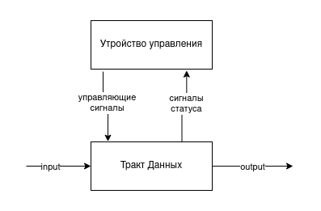

# GoMachine. Транслятор и модель

- P33302, Соловьев Павел Андреевич
- `asm | acc | neum | hw | tick | struct | trap | port | cstr | prob5 | spi`
- Без усложнения.

## Язык программирования

### Синтаксис

**Форма Бэкуса-Наура:**

```ebnf
<программа> ::= <строка_программы> | <строка_программы> <программа>
<строка_программы> ::= [<метка>] <адресная команда> <операнд> | 
    [<метка>] <безадресная команда> | [<метка>] word: <константа> | <пустая строка> |
    <комментарий> | <строка_программы> <комментарий>

<метка> ::= <слово>
<адресная команда> = add | ld | st | ... | sub | jmp | (см. систему команд)
<безадресная команда> ::= cla | di | ei | ... | hlt
<операнд> ::= <число> | <метка> | (<метка>)
<константа> ::= <число> | '<слово>' | <метка>
<слово> ::= <символ> | <слово> <символ>
<число> ::= <цифра> | <число> <цифра>
<цифра> ::= 0 | 1 | 2 | .. | 8 | 9
<символ> ::= a | b | c | ... | z | A | B | C | ... | Z | <цифра>
```

**Пояснение:**

Каждая непустая строка программы это одно из нижеперечисленных:

* **адресная команда**
    * может иметь метку в начале
    * указывается название команды и адрес операнда через пробел
    * для косвенной адресации операнд указывается в скобках
* **безадресная команда**
    * может иметь метку в начале
    * указывается только название команды
* **константа**
    * может иметь метку в начале
    * указывается метка константы `word:` и константа
    * может представлять собой число или строку

Пример программы, вычисляющей С = A + B

```asm
A: word: 1
B: word: 2
C: word: 0

start: cla
    ld A
    add B
    st C
    hlt
```

**Семантика**

- Видимость данных -- глобальная
- Поддерживаются целочисленные литералы, находящиеся в диапазоне от $`-2^{31}`$ до $`2^{31}-1`$
- Поддерживаются строковые литералы, символы стоки необходимо заключить в кавычки. Пример: `word: 'hello world'`
- Код выполняется последовательно
- Программа обязательно должна включать метку `start:`, указывающую на 1-ю выполняемую инструкцию.
- Название метки не должно совпадать с названием команды или ключевым словом `word:`.
- Метки находятся на одной строке с командами, операнды находятся на одной строке с командами.
- Пустые строки, комментарии и символы пробела в начале и конце строки игнорируются.

Память выделяется статически, при запуске модели.

## Организация памяти

```
Регистры

| Аббревиатура | Описание                |
|--------------|-------------------------|
| AC           | аккумулятор             |
| IP           | счетчик команд          |
| SP           | указатель стека         |
| AR           | регистр адреса          |
| DR           | регистр данных          |
| PS           | регистр состояния       |
| CR           | регистр команд          |

Память
| Адрес   | Содержание                              |
|---------|-----------------------------------------|
| 0       | вектор прерывания (interrupt_handler)   |
| ...     |                                         |
| start:  | программа                               |
| ...     |                                         |
| hlt     |                                         |
| interrupt_handler: | обработчик прерывания        |
| ...     |                                         |
| 2047    | стек                                    |
|  <- SP                                            |
```

* Память команд и данныx --- общая (фон Нейман)
* Размер машинного слова --- `32` бит
* Память содержит `2^11` ячеек
* По адресу `0` находится вектор прерывания устройства ввода
* Адрес `2047` является указателем стека при старте процессора. Стек растет вверх.
* виды адресаций:
    * Прямая абсолютная
    * Косвенная
* Назначение регистров:
    * AC - основной регистр в аккумуляторной архитектуре. В него записываются результаты всех операций. Подключен к
      портам ввода-вывода
    * IP - хранит адрес следующей выполняемой команды
    * SP - используется для сохранения адреса возврата и регистра состояния на стеке
    * PS - хранит флаги `NZC`, а также бит разрешения прерываний
    * DR - хранит данные для записи в память и считывания из памяти
    * AR - хранит адрес ячейки для обращения к памяти

## Система команд

Особенности процессора:

- Машинное слово -- `32` бита, знаковое.
- В качестве аргументов команды принимают `11` битные беззнаковые адреса

Цикл команды:

1. Цикл выборки инструкции - по адресу из счетчика команд из памяти достается команда:
    - `IP -> AR; IP + 1 -> IP; mem[AR] -> DR; DR -> CR`
2. Цикл выборки адреса - для команд с косвенной адресацией по адресу из счетчика команд из памяти достается адрес:
    - `DR -> AR; mem[AR] -> DR`
3. Цикл выборки операнда - по адресу из счетчика команд из памяти достается операнд:
    - `DR -> AR; mem[AR] -> DR`
4. Цикл исполнения - выполняется команда. В случае необходимости результат записывается в аккумулятор.
5. Цикл прерывания - если во время исполнения команды произошло прерывание, то IP и PS сохраняются на стеке, а в IP
   записывается адрес обработчика прерывания. После завершения обработки прерывания IP и PS восстанавливаются из стека.

### Набор инструкций

| Инструкция   | Количество тактов<br/>(без выборки инструкции) | Описание                                                                                       |
|:-------------|:-----------------------------------------------|:-----------------------------------------------------------------------------------------------|
| ld `<addr>`  | 3-5                                            | загрузить значение из заданной ячейки                                                          |
| st `<addr>`  | 4-6                                            | загрузить значение в заданную ячейку                                                           |
| cmp `<addr>` | 3-5                                            | выставить флаги как результат вычитания заданной ячейки из аккумулятора, сохранить аккумулятор |
| add `<addr>` | 3-5                                            | добавить значение из заданной ячейки к аккумулятору                                            |
| sub `<addr>` | 3-5                                            | вычесть значение из заданной ячейки из аккумулятора                                            |
| jmp `<addr>` | 1                                              | перейти в заданную ячейку                                                                      |
| jn `<addr>`  | 1                                              | перейти по адресу, если N = 1                                                                  |
| jnn `<addr>` | 1                                              | перейти по адресу, если N = 0                                                                  |
| jc `<addr>`  | 1                                              | перейти по адресу, если C = 1                                                                  |
| jnc `<addr>` | 1                                              | перейти по адресу, если C = 0                                                                  |
| jz `<addr>`  | 1                                              | перейти по адресу, если Z = 1                                                                  |
| jnz `<addr>` | 1                                              | перейти по адресу, если Z = 0                                                                  |
| dec          | 1                                              | уменьшить значение в аккумуляторе на 1                                                         |
| inc          | 1                                              | увеличить значение в аккумуляторе на 1                                                         |
| cla          | 1                                              | очистить аккумулятор (записать в него 0)                                                       |
| hlt          | 0                                              | остановить работу программы                                                                    |
| iret         | 7                                              | возврат из прерывания                                                                          |
| push         | 4                                              | положить значение из аккумулятора на стек                                                      |
| pop          | 3                                              | достать значение с вершины стека и записать в аккумулятор                                      |
| di           | 1                                              | запретить прерывания                                                                           |
| ei           | 1                                              | разрешить прерывания                                                                           |
| nop          | 1                                              | отсутствие операции                                                                            |
| in           | 1                                              | считать значение из порта ввода в аккумулятор                                                  |
| out          | 1                                              | записать значение из аккумулятора в порт вывода                                                |

- выборка инструкции всегда происходит за 3 такта
- `<addr>` -- адрес ячейки памяти, к которой обращается команда. Косвенная адресация для инструкций ветвления не
  поддерживается.

### Кодирование инструкций

- Машинный код сереализуется в список JSON.
- Один элемент списка, одна инструкция или константа.

Пример сереализованной команды `jz spin_loop` и константы 10:

```json
[
  {
    "index": 7,
    "opcode": "JZ",
    "operand": 6,
    "operand_type": 3,
    "term_info": {
      "line_num": 9,
      "original_content": "jz spin_loop"
    }
  },
  {
    "index": 4,
    "label": "line_feed",
    "opcode": "NOP",
    "operand": 10,
    "operand_type": 1,
    "term_info": {
      "line_num": 5,
      "original_content": "line_feed: word: 10"
    }
  }
]
```

где:

- `index` -- адрес в памяти.
- `label` -- отладочная информация о метке, если она есть.
- `opcode` -- код оператора, идентификатор команды; У констант для упрощения всегда "NOP".
- `operand` -- аргумент команды, адрес ячейки над которой совершается операция. Отсутствует у безадресных команд.
- `operand_type` -- тип операнда. Используется для форматирования вывода и определения косвенной адресации.
- `term_info` -- отладочная информация о месте в исходном коде, откуда была взята команда.

## Транслятор

Интерфейс командной строки: `translator -input <assembly_file> -output <machine_code_file>`

Реализовано в пакете: [translator](./pkg/translator/translator.go)

Этапы трансляции (метод `Translate`):

1. `ParseInstructions` - парсинг кода построчно, определение типа команды (адресная, безадресная, константа)
2. `addIncicies` - нумеруем команды и константы
3. `convertTermsToMachineCode` - преобразуем лейблы в адреса, формируем термы.

Правила генерации машинного кода:

- Метки, использованные в качестве операнда, преобразуются в адреса команд

## Модель процессора

Интерфейс командной строки: `simulation -program <machine-code-file> -io-data <file-with-data>`

Реализовано в модуле: [machine](./pkg/machine/machine.go).

### DataPath

Реализован структурой `DataPath`.


`memory` -- однопортовая память, поэтому либо читаем, либо пишем.
Регистры (соответствуют регистрам на схеме):

- `AR`, `IP`, `DR`, `PC`, `SP`, `PS`, `AC`

Сигналы (реализованы в виде методов):

- `SigLatchRegister` -- защёлкнуть выбранное значение в регистре с указанным именем
- `ReadMemory` -- считать данные из `mem[AR]` в регистр `DR`
- `WriteMemory` -- записать данные из регистра `DR` в `mem[AR]`

В виде отдельного класса реализовано арифметико-логическое устройство (АЛУ)

- в данном классе реализован метод `Execute`, принимающий аргументы с одного или двух входов и совершающий над ними
  арифметико-логическую операцию
- в результате выполнения операций устанавливаются следующие флаги
    - `Z` -- значение в аккумуляторе равно 0
    - `N` -- значение в аккумуляторе отрицательно
    - `C` -- произошло переполнение (перенос из 16-го бита)

### ControlUnit

Реализован в классе `ControlUnit`.



- Метод `RunInstructionCycle` моделирует выполнение полного цикла инструкции (цикл выборки инструкции, операнда,
  исполнения)
- После завершения цикла исполнения проверяется, не произошел ли запрос прерывания, и разрешены ли прерывания. Если оба
  условия верны, то вызывается метод `processInterrupt`

Особенности работы модели:

- Цикл симуляции осуществляется в функции `simulation`.
- Шаг моделирования соответствует одному такту процессора с выводом состояния в журнал (каждая запись в журнале
  соответствует состоянию процессора после выполнения каждого такта)
- Для журнала состояний процессора используется поле структуры `stateOutput` типа `io.Writer`
- Количество инструкций для моделирования лимитировано.
- Остановка моделирования осуществляется при:
    - превышении лимита количества выполняемых инструкций;
    - контролируемой ошибке `ControlUnitError`, вызываемой `hlt` и `iret`
    - ошибке во время выполнения инструкций и вычислений

- обработка прерываний осуществляется в методе `processInterrupt`
    - на стек сохраняются текущие значения счетчика команд (IP), и регистра состояния (PS)
    - в IP записывается адрес из вектора прерываний (хранится в ячейке 0)
    - выполняются все команды для обработки прерывания. При выполнении команды  `iret` происходит возврат в основную
      программу
    - из стека достаются значения IP и PS и присваиваются соответствующим регистрам

Проверка наличия запроса прерывания осуществляется после завершения цикла исполнения каждой инструкции.

- Вложенные прерывания возможны, программист должен управлять запретом и разрешением прерываний самостоятельно при
  помощи команд:
    - ei (enable interrupt) --- разрешить прерывания
    - di (disable interrupt) --- запретить прерывания
- Все регистры кроме PS и IP программист должен самостоятельно сохранять на стек в методе-обработчике прерываний.

## Тестирование

Реализованные програмы

1. [hello world](tests/assembly/hello.asm) -- вывести на экран строку `'Hello World!'`
2. [cat](tests/assembly/cat.asm) -- программа `cat`, повторяем ввод на выводе.
3. [hello_user](tests/assembly/hello_user.asm) -- программа `hello_user` -- запросить у пользователя его имя, считать его,
   вывести на экран приветствие
4. [prob5](tests/assembly/prob5.asm): найти наименьшее число, которое делится на все числа от 1 до 20.

Интеграционные тесты реализованы тут [integration_test.go](./tests/integration_test.go):

- через golden tests, конфигурация которых лежит в папке [tests/testdata](./tests/testdata)

CI:

``` yaml
name: Linter and Tests

on:
  push:
    branches: [ "main" ]
  pull_request:
    branches: [ "main" ]

permissions:
  contents: read
  pull-requests: read
  checks: write

jobs:
  golangci:
    name: lint
    runs-on: ubuntu-latest
    steps:
      - uses: actions/checkout@v3
      - uses: actions/setup-go@v4
        with:
          go-version: '1.21'
          cache: false
      - name: golangci-lint
        uses: golangci/golangci-lint-action@v3
        with:
          version: v1.54
```

`golangci-lint` -- проверка кода на соответствие стандартам

Пример использования и журнал работы процессора на примере `cat`:

``` shell
➜ sem5/archCom/lab3 git:(main) ✗ go build -o translator ./cmd/translator/main.go
➜ sem5/archCom/lab3 git:(main) ✗ cat tests/assembly/cat.asm
vector: word: interrupt
in_port: word: 0
out_port: word: 1
flag: word: 0
line_feed: word: 10

start: ei
spin_loop: ld flag
  jz spin_loop
  hlt

interrupt: in in_port
  out out_port
  cmp line_feed
  jnz returning
  ld flag
  inc
  st flag
  returning: iret

➜ sem5/archCom/lab3 git:(main) ✗ ./translator -input tests/assembly/cat.asm -target /tmp/cat.asm
➜ sem5/archCom/lab3 git:(main) ✗ cat /tmp/cat.asm
{
  "StartAddress": 5,
  "Instructions": [
    {
      "index": 0,
      "label": "vector",
      "opcode": "NOP",
      "operand": 9,
      "operand_type": 3,
      "term_info": {
        "line_num": 1,
        "original_content": "vector: word: interrupt"
      }
    },
    {
      "index": 1,
      "label": "in_port",
      "opcode": "NOP",
      "operand": 0,
      "operand_type": 1,
      "term_info": {
        "line_num": 2,
        "original_content": "in_port: word: 0"
      }
    },
    {
      "index": 2,
      "label": "out_port",
      "opcode": "NOP",
      "operand": 1,
      "operand_type": 1,
      "term_info": {
        "line_num": 3,
        "original_content": "out_port: word: 1"
      }
    },
    {
      "index": 3,
      "label": "flag",
      "opcode": "NOP",
      "operand": 0,
      "operand_type": 1,
      "term_info": {
        "line_num": 4,
        "original_content": "flag: word: 0"
      }
    },
    {
      "index": 4,
      "label": "line_feed",
      "opcode": "NOP",
      "operand": 10,
      "operand_type": 1,
      "term_info": {
        "line_num": 5,
        "original_content": "line_feed: word: 10"
      }
    },
    {
      "index": 5,
      "label": "start",
      "opcode": "EI",
      "term_info": {
        "line_num": 7,
        "original_content": "start: ei"
      }
    },
    {
      "index": 6,
      "label": "spin_loop",
      "opcode": "LD",
      "operand": 3,
      "operand_type": 3,
      "term_info": {
        "line_num": 8,
        "original_content": "spin_loop: ld flag"
      }
    },
    ...
  ]
}

➜ sem5/archCom/lab3 git:(main) ✗ go build -o machine ./cmd/simulation/main.go
➜ sem5/archCom/lab3 git:(main) ✗ ./machine -io-data ./tests/inputs/cat.json -program /tmp/cat.asm
2024/01/12 19:53:03 starting simulation
t0    | IP -> AR                      | AC:  0, IP:  5, CR: NOP 0, PS:  0, SP: 2048, DR:  0, AR:  5 | !Z !N !C DI | mem[AR]: EI
t1    | IP + 1 -> IP; mem[AR] -> DR   | AC:  0, IP:  6, CR: NOP 0, PS:  0, SP: 2048, DR:  0, AR:  5 | !Z !N !C DI | mem[AR]: EI
t2    | DR -> CR                      | AC:  0, IP:  6, CR:    EI, PS:  0, SP: 2048, DR:  0, AR:  5 | !Z !N !C DI | mem[AR]: EI
t3    | 1 -> PS[EI]                   | AC:  0, IP:  6, CR:    EI, PS: 32, SP: 2048, DR:  0, AR:  5 | !Z !N !C EI | mem[AR]: EI
t4    | 0 -> PS[EI]                   | AC:  0, IP:  6, CR:    EI, PS:  0, SP: 2048, DR:  0, AR:  5 | !Z !N !C DI | mem[AR]: EI
t5    | SP - 1 -> SP                  | AC:  0, IP:  6, CR:    EI, PS:  0, SP: 2047, DR:  0, AR:  5 | !Z !N !C DI | mem[AR]: EI
t6    | SP -> AR                      | AC:  0, IP:  6, CR:    EI, PS:  0, SP: 2047, DR:  0, AR: 2047 | !Z !N !C DI | mem[AR]: 0
t7    | IP -> DR                      | AC:  0, IP:  6, CR:    EI, PS:  0, SP: 2047, DR:  6, AR: 2047 | !Z !N !C DI | mem[AR]: 0
t8    | DR -> mem[AR]                 | AC:  0, IP:  6, CR:    EI, PS:  0, SP: 2047, DR:  6, AR: 2047 | !Z !N !C DI | mem[AR]: 6
t9    | SP - 1 -> SP                  | AC:  0, IP:  6, CR:    EI, PS:  0, SP: 2046, DR:  6, AR: 2047 | !Z !N !C DI | mem[AR]: 6
t10   | SP -> AR                      | AC:  0, IP:  6, CR:    EI, PS:  0, SP: 2046, DR:  6, AR: 2046 | !Z !N !C DI | mem[AR]: 0
t11   | PS -> DR                      | AC:  0, IP:  6, CR:    EI, PS:  0, SP: 2046, DR:  0, AR: 2046 | !Z !N !C DI | mem[AR]: 0
t12   | DR -> mem[AR]                 | AC:  0, IP:  6, CR:    EI, PS:  0, SP: 2046, DR:  0, AR: 2046 | !Z !N !C DI | mem[AR]: 0
t13   | intVec -> AR                  | AC:  0, IP:  6, CR:    EI, PS:  0, SP: 2046, DR:  0, AR:  0 | !Z !N !C DI | mem[AR]: 9
t14   | mem[AR] -> DR                 | AC:  0, IP:  6, CR:    EI, PS:  0, SP: 2046, DR:  9, AR:  0 | !Z !N !C DI | mem[AR]: 9
t15   | DR -> IP                      | AC:  0, IP:  9, CR:    EI, PS:  0, SP: 2046, DR:  9, AR:  0 | !Z !N !C DI | mem[AR]: 9
t16   | IP -> AR                      | AC:  0, IP:  9, CR:    EI, PS:  0, SP: 2046, DR:  9, AR:  9 | !Z !N !C DI | mem[AR]: IN 1
t17   | IP + 1 -> IP; mem[AR] -> DR   | AC:  0, IP: 10, CR:    EI, PS:  0, SP: 2046, DR:  1, AR:  9 | !Z !N !C DI | mem[AR]: IN 1
t18   | DR -> CR                      | AC:  0, IP: 10, CR:  IN 1, PS:  0, SP: 2046, DR:  1, AR:  9 | !Z !N !C DI | mem[AR]: IN 1
t19   | IN -> AC                      | AC: 97, IP: 10, CR:  IN 1, PS:  0, SP: 2046, DR:  1, AR:  9 | !Z !N !C DI | mem[AR]: IN 1

t20   | IP -> AR                      | AC: 97, IP: 10, CR:  IN 1, PS:  0, SP: 2046, DR:  1, AR: 10 | !Z !N !C DI | mem[AR]: OUT 2
t21   | IP + 1 -> IP; mem[AR] -> DR   | AC: 97, IP: 11, CR:  IN 1, PS:  0, SP: 2046, DR:  2, AR: 10 | !Z !N !C DI | mem[AR]: OUT 2
t22   | DR -> CR                      | AC: 97, IP: 11, CR: OUT 2, PS:  0, SP: 2046, DR:  2, AR: 10 | !Z !N !C DI | mem[AR]: OUT 2
at23   | AC -> OUT                     | AC: 97, IP: 11, CR: OUT 2, PS:  0, SP: 2046, DR:  2, AR: 10 | !Z !N !C DI | mem[AR]: OUT 2

t24   | IP -> AR                      | AC: 97, IP: 11, CR: OUT 2, PS:  0, SP: 2046, DR:  2, AR: 11 | !Z !N !C DI | mem[AR]: CMP 4
t25   | IP + 1 -> IP; mem[AR] -> DR   | AC: 97, IP: 12, CR: OUT 2, PS:  0, SP: 2046, DR:  4, AR: 11 | !Z !N !C DI | mem[AR]: CMP 4
t26   | DR -> CR                      | AC: 97, IP: 12, CR: CMP 4, PS:  0, SP: 2046, DR:  4, AR: 11 | !Z !N !C DI | mem[AR]: CMP 4
t27   | DR -> AR                      | AC: 97, IP: 12, CR: CMP 4, PS:  0, SP: 2046, DR:  4, AR:  4 | !Z !N !C DI | mem[AR]: 10
t28   | mem[AR] -> DR                 | AC: 97, IP: 12, CR: CMP 4, PS:  0, SP: 2046, DR: 10, AR:  4 | !Z !N !C DI | mem[AR]: 10
t29   | AC - DR -> NZC                | AC: 97, IP: 12, CR: CMP 4, PS:  0, SP: 2046, DR: 10, AR:  4 | !Z !N !C DI | mem[AR]: 10

t30   | IP -> AR                      | AC: 97, IP: 12, CR: CMP 4, PS:  0, SP: 2046, DR: 10, AR: 12 | !Z !N !C DI | mem[AR]: JNZ 16
t31   | IP + 1 -> IP; mem[AR] -> DR   | AC: 97, IP: 13, CR: CMP 4, PS:  0, SP: 2046, DR: 16, AR: 12 | !Z !N !C DI | mem[AR]: JNZ 16
t32   | DR -> CR                      | AC: 97, IP: 13, CR: JNZ 16, PS:  0, SP: 2046, DR: 16, AR: 12 | !Z !N !C DI | mem[AR]: JNZ 16
t33   | DR -> IP                      | AC: 97, IP: 16, CR: JNZ 16, PS:  0, SP: 2046, DR: 16, AR: 12 | !Z !N !C DI | mem[AR]: JNZ 16

t34   | IP -> AR                      | AC: 97, IP: 16, CR: JNZ 16, PS:  0, SP: 2046, DR: 16, AR: 16 | !Z !N !C DI | mem[AR]: IRET
t35   | IP + 1 -> IP; mem[AR] -> DR   | AC: 97, IP: 17, CR: JNZ 16, PS:  0, SP: 2046, DR:  0, AR: 16 | !Z !N !C DI | mem[AR]: IRET
t36   | DR -> CR                      | AC: 97, IP: 17, CR:  IRET, PS:  0, SP: 2046, DR:  0, AR: 16 | !Z !N !C DI | mem[AR]: IRET
t37   | SP -> AR                      | AC: 97, IP: 17, CR:  IRET, PS:  0, SP: 2046, DR:  0, AR: 2046 | !Z !N !C DI | mem[AR]: 0
t38   | mem[AR] -> DR; SP + 1 -> SP   | AC: 97, IP: 17, CR:  IRET, PS:  0, SP: 2047, DR:  0, AR: 2046 | !Z !N !C DI | mem[AR]: 0
t39   | DR -> PS                      | AC: 97, IP: 17, CR:  IRET, PS:  0, SP: 2047, DR:  0, AR: 2046 | !Z !N !C DI | mem[AR]: 0
t40   | SP -> AR                      | AC: 97, IP: 17, CR:  IRET, PS:  0, SP: 2047, DR:  0, AR: 2047 | !Z !N !C DI | mem[AR]: 6
t41   | mem[AR] -> DR; SP + 1 -> SP   | AC: 97, IP: 17, CR:  IRET, PS:  0, SP: 2048, DR:  6, AR: 2047 | !Z !N !C DI | mem[AR]: 6
t42   | DR -> IP                      | AC: 97, IP:  6, CR:  IRET, PS:  0, SP: 2048, DR:  6, AR: 2047 | !Z !N !C DI | mem[AR]: 6
t43   | 1 -> PS[EI]                   | AC: 97, IP:  6, CR:  IRET, PS: 32, SP: 2048, DR:  6, AR: 2047 | !Z !N !C EI | mem[AR]: 6
t44   | 0 -> PS[EI]                   | AC: 97, IP:  6, CR:  IRET, PS:  0, SP: 2048, DR:  6, AR: 2047 | !Z !N !C DI | mem[AR]: 6
t45   | SP - 1 -> SP                  | AC: 97, IP:  6, CR:  IRET, PS:  0, SP: 2047, DR:  6, AR: 2047 | !Z !N !C DI | mem[AR]: 6
t46   | SP -> AR                      | AC: 97, IP:  6, CR:  IRET, PS:  0, SP: 2047, DR:  6, AR: 2047 | !Z !N !C DI | mem[AR]: 6
t47   | IP -> DR                      | AC: 97, IP:  6, CR:  IRET, PS:  0, SP: 2047, DR:  6, AR: 2047 | !Z !N !C DI | mem[AR]: 6
t48   | DR -> mem[AR]                 | AC: 97, IP:  6, CR:  IRET, PS:  0, SP: 2047, DR:  6, AR: 2047 | !Z !N !C DI | mem[AR]: 6
t49   | SP - 1 -> SP                  | AC: 97, IP:  6, CR:  IRET, PS:  0, SP: 2046, DR:  6, AR: 2047 | !Z !N !C DI | mem[AR]: 6
t50   | SP -> AR                      | AC: 97, IP:  6, CR:  IRET, PS:  0, SP: 2046, DR:  6, AR: 2046 | !Z !N !C DI | mem[AR]: 0
t51   | PS -> DR                      | AC: 97, IP:  6, CR:  IRET, PS:  0, SP: 2046, DR:  0, AR: 2046 | !Z !N !C DI | mem[AR]: 0
t52   | DR -> mem[AR]                 | AC: 97, IP:  6, CR:  IRET, PS:  0, SP: 2046, DR:  0, AR: 2046 | !Z !N !C DI | mem[AR]: 0
t53   | intVec -> AR                  | AC: 97, IP:  6, CR:  IRET, PS:  0, SP: 2046, DR:  0, AR:  0 | !Z !N !C DI | mem[AR]: 9
t54   | mem[AR] -> DR                 | AC: 97, IP:  6, CR:  IRET, PS:  0, SP: 2046, DR:  9, AR:  0 | !Z !N !C DI | mem[AR]: 9
t55   | DR -> IP                      | AC: 97, IP:  9, CR:  IRET, PS:  0, SP: 2046, DR:  9, AR:  0 | !Z !N !C DI | mem[AR]: 9
t56   | IP -> AR                      | AC: 97, IP:  9, CR:  IRET, PS:  0, SP: 2046, DR:  9, AR:  9 | !Z !N !C DI | mem[AR]: IN 1
t57   | IP + 1 -> IP; mem[AR] -> DR   | AC: 97, IP: 10, CR:  IRET, PS:  0, SP: 2046, DR:  1, AR:  9 | !Z !N !C DI | mem[AR]: IN 1
t58   | DR -> CR                      | AC: 97, IP: 10, CR:  IN 1, PS:  0, SP: 2046, DR:  1, AR:  9 | !Z !N !C DI | mem[AR]: IN 1
t59   | IN -> AC                      | AC: 98, IP: 10, CR:  IN 1, PS:  0, SP: 2046, DR:  1, AR:  9 | !Z !N !C DI | mem[AR]: IN 1

t60   | IP -> AR                      | AC: 98, IP: 10, CR:  IN 1, PS:  0, SP: 2046, DR:  1, AR: 10 | !Z !N !C DI | mem[AR]: OUT 2
t61   | IP + 1 -> IP; mem[AR] -> DR   | AC: 98, IP: 11, CR:  IN 1, PS:  0, SP: 2046, DR:  2, AR: 10 | !Z !N !C DI | mem[AR]: OUT 2
t62   | DR -> CR                      | AC: 98, IP: 11, CR: OUT 2, PS:  0, SP: 2046, DR:  2, AR: 10 | !Z !N !C DI | mem[AR]: OUT 2
bt63   | AC -> OUT                     | AC: 98, IP: 11, CR: OUT 2, PS:  0, SP: 2046, DR:  2, AR: 10 | !Z !N !C DI | mem[AR]: OUT 2

t64   | IP -> AR                      | AC: 98, IP: 11, CR: OUT 2, PS:  0, SP: 2046, DR:  2, AR: 11 | !Z !N !C DI | mem[AR]: CMP 4
t65   | IP + 1 -> IP; mem[AR] -> DR   | AC: 98, IP: 12, CR: OUT 2, PS:  0, SP: 2046, DR:  4, AR: 11 | !Z !N !C DI | mem[AR]: CMP 4
t66   | DR -> CR                      | AC: 98, IP: 12, CR: CMP 4, PS:  0, SP: 2046, DR:  4, AR: 11 | !Z !N !C DI | mem[AR]: CMP 4
t67   | DR -> AR                      | AC: 98, IP: 12, CR: CMP 4, PS:  0, SP: 2046, DR:  4, AR:  4 | !Z !N !C DI | mem[AR]: 10
t68   | mem[AR] -> DR                 | AC: 98, IP: 12, CR: CMP 4, PS:  0, SP: 2046, DR: 10, AR:  4 | !Z !N !C DI | mem[AR]: 10
t69   | AC - DR -> NZC                | AC: 98, IP: 12, CR: CMP 4, PS:  0, SP: 2046, DR: 10, AR:  4 | !Z !N !C DI | mem[AR]: 10

t70   | IP -> AR                      | AC: 98, IP: 12, CR: CMP 4, PS:  0, SP: 2046, DR: 10, AR: 12 | !Z !N !C DI | mem[AR]: JNZ 16
t71   | IP + 1 -> IP; mem[AR] -> DR   | AC: 98, IP: 13, CR: CMP 4, PS:  0, SP: 2046, DR: 16, AR: 12 | !Z !N !C DI | mem[AR]: JNZ 16
t72   | DR -> CR                      | AC: 98, IP: 13, CR: JNZ 16, PS:  0, SP: 2046, DR: 16, AR: 12 | !Z !N !C DI | mem[AR]: JNZ 16
t73   | DR -> IP                      | AC: 98, IP: 16, CR: JNZ 16, PS:  0, SP: 2046, DR: 16, AR: 12 | !Z !N !C DI | mem[AR]: JNZ 16

t74   | IP -> AR                      | AC: 98, IP: 16, CR: JNZ 16, PS:  0, SP: 2046, DR: 16, AR: 16 | !Z !N !C DI | mem[AR]: IRET
t75   | IP + 1 -> IP; mem[AR] -> DR   | AC: 98, IP: 17, CR: JNZ 16, PS:  0, SP: 2046, DR:  0, AR: 16 | !Z !N !C DI | mem[AR]: IRET
t76   | DR -> CR                      | AC: 98, IP: 17, CR:  IRET, PS:  0, SP: 2046, DR:  0, AR: 16 | !Z !N !C DI | mem[AR]: IRET
t77   | SP -> AR                      | AC: 98, IP: 17, CR:  IRET, PS:  0, SP: 2046, DR:  0, AR: 2046 | !Z !N !C DI | mem[AR]: 0
t78   | mem[AR] -> DR; SP + 1 -> SP   | AC: 98, IP: 17, CR:  IRET, PS:  0, SP: 2047, DR:  0, AR: 2046 | !Z !N !C DI | mem[AR]: 0
t79   | DR -> PS                      | AC: 98, IP: 17, CR:  IRET, PS:  0, SP: 2047, DR:  0, AR: 2046 | !Z !N !C DI | mem[AR]: 0
t80   | SP -> AR                      | AC: 98, IP: 17, CR:  IRET, PS:  0, SP: 2047, DR:  0, AR: 2047 | !Z !N !C DI | mem[AR]: 6
t81   | mem[AR] -> DR; SP + 1 -> SP   | AC: 98, IP: 17, CR:  IRET, PS:  0, SP: 2048, DR:  6, AR: 2047 | !Z !N !C DI | mem[AR]: 6
t82   | DR -> IP                      | AC: 98, IP:  6, CR:  IRET, PS:  0, SP: 2048, DR:  6, AR: 2047 | !Z !N !C DI | mem[AR]: 6
t83   | 1 -> PS[EI]                   | AC: 98, IP:  6, CR:  IRET, PS: 32, SP: 2048, DR:  6, AR: 2047 | !Z !N !C EI | mem[AR]: 6

t84   | IP -> AR                      | AC: 98, IP:  6, CR:  IRET, PS: 32, SP: 2048, DR:  6, AR:  6 | !Z !N !C EI | mem[AR]: LD 3
t85   | IP + 1 -> IP; mem[AR] -> DR   | AC: 98, IP:  7, CR:  IRET, PS: 32, SP: 2048, DR:  3, AR:  6 | !Z !N !C EI | mem[AR]: LD 3
t86   | DR -> CR                      | AC: 98, IP:  7, CR:  LD 3, PS: 32, SP: 2048, DR:  3, AR:  6 | !Z !N !C EI | mem[AR]: LD 3
t87   | DR -> AR                      | AC: 98, IP:  7, CR:  LD 3, PS: 32, SP: 2048, DR:  3, AR:  3 | !Z !N !C EI | mem[AR]: 0
t88   | mem[AR] -> DR                 | AC: 98, IP:  7, CR:  LD 3, PS: 32, SP: 2048, DR:  0, AR:  3 | !Z !N !C EI | mem[AR]: 0
t89   | DR -> AC                      | AC:  0, IP:  7, CR:  LD 3, PS: 36, SP: 2048, DR:  0, AR:  3 | Z !N !C EI | mem[AR]: 0
t90   | 0 -> PS[EI]                   | AC:  0, IP:  7, CR:  LD 3, PS:  4, SP: 2048, DR:  0, AR:  3 | Z !N !C DI | mem[AR]: 0
t91   | SP - 1 -> SP                  | AC:  0, IP:  7, CR:  LD 3, PS:  4, SP: 2047, DR:  0, AR:  3 | Z !N !C DI | mem[AR]: 0
t92   | SP -> AR                      | AC:  0, IP:  7, CR:  LD 3, PS:  4, SP: 2047, DR:  0, AR: 2047 | Z !N !C DI | mem[AR]: 6
t93   | IP -> DR                      | AC:  0, IP:  7, CR:  LD 3, PS:  4, SP: 2047, DR:  7, AR: 2047 | Z !N !C DI | mem[AR]: 6
t94   | DR -> mem[AR]                 | AC:  0, IP:  7, CR:  LD 3, PS:  4, SP: 2047, DR:  7, AR: 2047 | Z !N !C DI | mem[AR]: 7
t95   | SP - 1 -> SP                  | AC:  0, IP:  7, CR:  LD 3, PS:  4, SP: 2046, DR:  7, AR: 2047 | Z !N !C DI | mem[AR]: 7
t96   | SP -> AR                      | AC:  0, IP:  7, CR:  LD 3, PS:  4, SP: 2046, DR:  7, AR: 2046 | Z !N !C DI | mem[AR]: 0
t97   | PS -> DR                      | AC:  0, IP:  7, CR:  LD 3, PS:  4, SP: 2046, DR:  4, AR: 2046 | Z !N !C DI | mem[AR]: 0
t98   | DR -> mem[AR]                 | AC:  0, IP:  7, CR:  LD 3, PS:  4, SP: 2046, DR:  4, AR: 2046 | Z !N !C DI | mem[AR]: 4
t99   | intVec -> AR                  | AC:  0, IP:  7, CR:  LD 3, PS:  4, SP: 2046, DR:  4, AR:  0 | Z !N !C DI | mem[AR]: 9
t100  | mem[AR] -> DR                 | AC:  0, IP:  7, CR:  LD 3, PS:  4, SP: 2046, DR:  9, AR:  0 | Z !N !C DI | mem[AR]: 9
t101  | DR -> IP                      | AC:  0, IP:  9, CR:  LD 3, PS:  4, SP: 2046, DR:  9, AR:  0 | Z !N !C DI | mem[AR]: 9
t102  | IP -> AR                      | AC:  0, IP:  9, CR:  LD 3, PS:  4, SP: 2046, DR:  9, AR:  9 | Z !N !C DI | mem[AR]: IN 1
t103  | IP + 1 -> IP; mem[AR] -> DR   | AC:  0, IP: 10, CR:  LD 3, PS:  4, SP: 2046, DR:  1, AR:  9 | Z !N !C DI | mem[AR]: IN 1
t104  | DR -> CR                      | AC:  0, IP: 10, CR:  IN 1, PS:  4, SP: 2046, DR:  1, AR:  9 | Z !N !C DI | mem[AR]: IN 1
t105  | IN -> AC                      | AC: 10, IP: 10, CR:  IN 1, PS:  4, SP: 2046, DR:  1, AR:  9 | Z !N !C DI | mem[AR]: IN 1

t106  | IP -> AR                      | AC: 10, IP: 10, CR:  IN 1, PS:  4, SP: 2046, DR:  1, AR: 10 | Z !N !C DI | mem[AR]: OUT 2
t107  | IP + 1 -> IP; mem[AR] -> DR   | AC: 10, IP: 11, CR:  IN 1, PS:  4, SP: 2046, DR:  2, AR: 10 | Z !N !C DI | mem[AR]: OUT 2
t108  | DR -> CR                      | AC: 10, IP: 11, CR: OUT 2, PS:  4, SP: 2046, DR:  2, AR: 10 | Z !N !C DI | mem[AR]: OUT 2

t109  | AC -> OUT                     | AC: 10, IP: 11, CR: OUT 2, PS:  4, SP: 2046, DR:  2, AR: 10 | Z !N !C DI | mem[AR]: OUT 2

t110  | IP -> AR                      | AC: 10, IP: 11, CR: OUT 2, PS:  4, SP: 2046, DR:  2, AR: 11 | Z !N !C DI | mem[AR]: CMP 4
t111  | IP + 1 -> IP; mem[AR] -> DR   | AC: 10, IP: 12, CR: OUT 2, PS:  4, SP: 2046, DR:  4, AR: 11 | Z !N !C DI | mem[AR]: CMP 4
t112  | DR -> CR                      | AC: 10, IP: 12, CR: CMP 4, PS:  4, SP: 2046, DR:  4, AR: 11 | Z !N !C DI | mem[AR]: CMP 4
t113  | DR -> AR                      | AC: 10, IP: 12, CR: CMP 4, PS:  4, SP: 2046, DR:  4, AR:  4 | Z !N !C DI | mem[AR]: 10
t114  | mem[AR] -> DR                 | AC: 10, IP: 12, CR: CMP 4, PS:  4, SP: 2046, DR: 10, AR:  4 | Z !N !C DI | mem[AR]: 10
t115  | AC - DR -> NZC                | AC: 10, IP: 12, CR: CMP 4, PS:  4, SP: 2046, DR: 10, AR:  4 | Z !N !C DI | mem[AR]: 10

t116  | IP -> AR                      | AC: 10, IP: 12, CR: CMP 4, PS:  4, SP: 2046, DR: 10, AR: 12 | Z !N !C DI | mem[AR]: JNZ 16
t117  | IP + 1 -> IP; mem[AR] -> DR   | AC: 10, IP: 13, CR: CMP 4, PS:  4, SP: 2046, DR: 16, AR: 12 | Z !N !C DI | mem[AR]: JNZ 16
t118  | DR -> CR                      | AC: 10, IP: 13, CR: JNZ 16, PS:  4, SP: 2046, DR: 16, AR: 12 | Z !N !C DI | mem[AR]: JNZ 16

t119  | IP -> AR                      | AC: 10, IP: 13, CR: JNZ 16, PS:  4, SP: 2046, DR: 16, AR: 13 | Z !N !C DI | mem[AR]: LD 3
t120  | IP + 1 -> IP; mem[AR] -> DR   | AC: 10, IP: 14, CR: JNZ 16, PS:  4, SP: 2046, DR:  3, AR: 13 | Z !N !C DI | mem[AR]: LD 3
t121  | DR -> CR                      | AC: 10, IP: 14, CR:  LD 3, PS:  4, SP: 2046, DR:  3, AR: 13 | Z !N !C DI | mem[AR]: LD 3
t122  | DR -> AR                      | AC: 10, IP: 14, CR:  LD 3, PS:  4, SP: 2046, DR:  3, AR:  3 | Z !N !C DI | mem[AR]: 0
t123  | mem[AR] -> DR                 | AC: 10, IP: 14, CR:  LD 3, PS:  4, SP: 2046, DR:  0, AR:  3 | Z !N !C DI | mem[AR]: 0
t124  | DR -> AC                      | AC:  0, IP: 14, CR:  LD 3, PS:  4, SP: 2046, DR:  0, AR:  3 | Z !N !C DI | mem[AR]: 0

t125  | IP -> AR                      | AC:  0, IP: 14, CR:  LD 3, PS:  4, SP: 2046, DR:  0, AR: 14 | Z !N !C DI | mem[AR]: INC
t126  | IP + 1 -> IP; mem[AR] -> DR   | AC:  0, IP: 15, CR:  LD 3, PS:  4, SP: 2046, DR:  0, AR: 14 | Z !N !C DI | mem[AR]: INC
t127  | DR -> CR                      | AC:  0, IP: 15, CR:   INC, PS:  4, SP: 2046, DR:  0, AR: 14 | Z !N !C DI | mem[AR]: INC
t128  | AC + 1 -> AC                  | AC:  1, IP: 15, CR:   INC, PS:  0, SP: 2046, DR:  0, AR: 14 | !Z !N !C DI | mem[AR]: INC

t129  | IP -> AR                      | AC:  1, IP: 15, CR:   INC, PS:  0, SP: 2046, DR:  0, AR: 15 | !Z !N !C DI | mem[AR]: ST 3
t130  | IP + 1 -> IP; mem[AR] -> DR   | AC:  1, IP: 16, CR:   INC, PS:  0, SP: 2046, DR:  3, AR: 15 | !Z !N !C DI | mem[AR]: ST 3
t131  | DR -> CR                      | AC:  1, IP: 16, CR:  ST 3, PS:  0, SP: 2046, DR:  3, AR: 15 | !Z !N !C DI | mem[AR]: ST 3
t132  | DR -> AR                      | AC:  1, IP: 16, CR:  ST 3, PS:  0, SP: 2046, DR:  3, AR:  3 | !Z !N !C DI | mem[AR]: 0
t133  | mem[AR] -> DR                 | AC:  1, IP: 16, CR:  ST 3, PS:  0, SP: 2046, DR:  0, AR:  3 | !Z !N !C DI | mem[AR]: 0
t134  | AC -> DR                      | AC:  1, IP: 16, CR:  ST 3, PS:  0, SP: 2046, DR:  1, AR:  3 | !Z !N !C DI | mem[AR]: 0
t135  | DR -> mem[AR]                 | AC:  1, IP: 16, CR:  ST 3, PS:  0, SP: 2046, DR:  1, AR:  3 | !Z !N !C DI | mem[AR]: 1

t136  | IP -> AR                      | AC:  1, IP: 16, CR:  ST 3, PS:  0, SP: 2046, DR:  1, AR: 16 | !Z !N !C DI | mem[AR]: IRET
t137  | IP + 1 -> IP; mem[AR] -> DR   | AC:  1, IP: 17, CR:  ST 3, PS:  0, SP: 2046, DR:  0, AR: 16 | !Z !N !C DI | mem[AR]: IRET
t138  | DR -> CR                      | AC:  1, IP: 17, CR:  IRET, PS:  0, SP: 2046, DR:  0, AR: 16 | !Z !N !C DI | mem[AR]: IRET
t139  | SP -> AR                      | AC:  1, IP: 17, CR:  IRET, PS:  0, SP: 2046, DR:  0, AR: 2046 | !Z !N !C DI | mem[AR]: 4
t140  | mem[AR] -> DR; SP + 1 -> SP   | AC:  1, IP: 17, CR:  IRET, PS:  0, SP: 2047, DR:  4, AR: 2046 | !Z !N !C DI | mem[AR]: 4
t141  | DR -> PS                      | AC:  1, IP: 17, CR:  IRET, PS:  4, SP: 2047, DR:  4, AR: 2046 | Z !N !C DI | mem[AR]: 4
t142  | SP -> AR                      | AC:  1, IP: 17, CR:  IRET, PS:  0, SP: 2047, DR:  4, AR: 2047 | !Z !N !C DI | mem[AR]: 7
t143  | mem[AR] -> DR; SP + 1 -> SP   | AC:  1, IP: 17, CR:  IRET, PS:  0, SP: 2048, DR:  7, AR: 2047 | !Z !N !C DI | mem[AR]: 7
t144  | DR -> IP                      | AC:  1, IP:  7, CR:  IRET, PS:  0, SP: 2048, DR:  7, AR: 2047 | !Z !N !C DI | mem[AR]: 7
t145  | 1 -> PS[EI]                   | AC:  1, IP:  7, CR:  IRET, PS: 32, SP: 2048, DR:  7, AR: 2047 | !Z !N !C EI | mem[AR]: 7

t146  | IP -> AR                      | AC:  1, IP:  7, CR:  IRET, PS: 32, SP: 2048, DR:  7, AR:  7 | !Z !N !C EI | mem[AR]: JZ 6
t147  | IP + 1 -> IP; mem[AR] -> DR   | AC:  1, IP:  8, CR:  IRET, PS: 32, SP: 2048, DR:  6, AR:  7 | !Z !N !C EI | mem[AR]: JZ 6
t148  | DR -> CR                      | AC:  1, IP:  8, CR:  JZ 6, PS: 32, SP: 2048, DR:  6, AR:  7 | !Z !N !C EI | mem[AR]: JZ 6

t149  | IP -> AR                      | AC:  1, IP:  8, CR:  JZ 6, PS: 32, SP: 2048, DR:  6, AR:  8 | !Z !N !C EI | mem[AR]: HLT
t150  | IP + 1 -> IP; mem[AR] -> DR   | AC:  1, IP:  9, CR:  JZ 6, PS: 32, SP: 2048, DR:  0, AR:  8 | !Z !N !C EI | mem[AR]: HLT
t151  | DR -> CR                      | AC:  1, IP:  9, CR:   HLT, PS: 32, SP: 2048, DR:  0, AR:  8 | !Z !N !C EI | mem[AR]: HLT
2024/01/12 19:53:03 simulation finished
```

Пример проверки исходного кода:

``` shell
➜ sem5/archCom/lab3 git:(main) ✗ go test -v ./...
?       github.com/Moleus/comp-arch-lab3/cmd/simulation [no test files]
?       github.com/Moleus/comp-arch-lab3/cmd/translator [no test files]
?       github.com/Moleus/comp-arch-lab3/pkg/isa        [no test files]
?       github.com/Moleus/comp-arch-lab3/pkg/machine    [no test files]
=== RUN   TestParseConstant
=== RUN   TestParseConstant/parse_numeric_constant
=== RUN   TestParseConstant/parse_string_constant
--- PASS: TestParseConstant (0.00s)
    --- PASS: TestParseConstant/parse_numeric_constant (0.00s)
    --- PASS: TestParseConstant/parse_string_constant (0.00s)
PASS
ok      github.com/Moleus/comp-arch-lab3/pkg/translator (cached)
=== RUN   TestTranslationAndSimulation
=== RUN   TestTranslationAndSimulation/cat.yml
2024/01/12 20:00:48 starting simulation
2024/01/12 20:00:48 simulation finished
=== RUN   TestTranslationAndSimulation/hello.yml
2024/01/12 20:00:48 starting simulation
2024/01/12 20:00:48 simulation finished
=== RUN   TestTranslationAndSimulation/hello_user.yml
2024/01/12 20:00:48 starting simulation
2024/01/12 20:00:48 simulation finished
=== RUN   TestTranslationAndSimulation/prob5.yml
2024/01/12 20:00:48 starting simulation
2024/01/12 20:00:49 simulation finished
--- PASS: TestTranslationAndSimulation (0.52s)
    --- PASS: TestTranslationAndSimulation/cat.yml (0.00s)
    --- PASS: TestTranslationAndSimulation/hello.yml (0.01s)
    --- PASS: TestTranslationAndSimulation/hello_user.yml (0.02s)
    --- PASS: TestTranslationAndSimulation/prob5.yml (0.48s)
PASS
ok      github.com/Moleus/comp-arch-lab3/tests  0.521s
```

TODO: last table with statistics