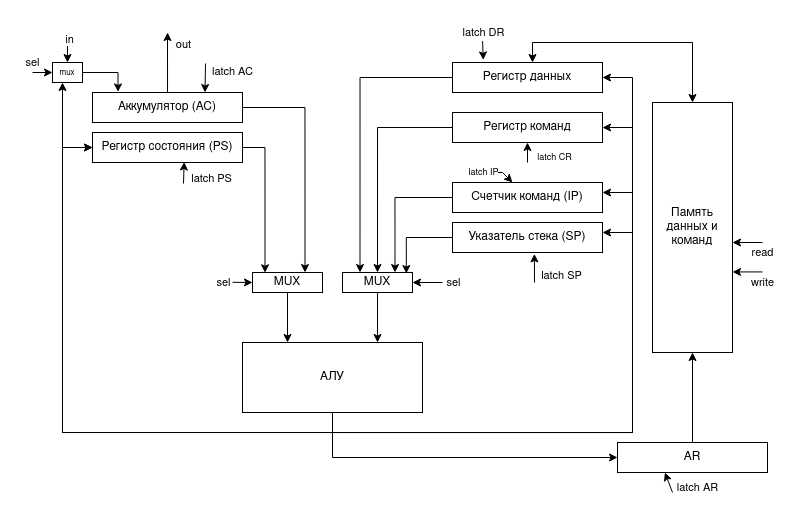

# GoMachine. Транслятор и модель

- P33302, Соловьев Павел Андреевич
- `asm | acc | neum | hw | tick | struct | trap | port | cstr | prob5 | spi`
- Без усложнения.

## Язык программирования

### Синтаксис

**Форма Бэкуса-Наура:**

```ebnf
<программа> ::= <строка_программы> | <строка_программы> <программа>
<строка_программы> ::= [<метка>] <адресная команда> <операнд> | 
    [<метка>] <безадресная команда> | [<метка>] word: <константа> | <пустая строка> |
    <комментарий> | <строка_программы> <комментарий>

<метка> ::= <слово>
<адресная команда> = add | ld | st | ... | sub | jmp | (см. систему команд)
<безадресная команда> ::= cla | di | ei | ... | hlt
<операнд> ::= <число> | <метка> | (<метка>)
<константа> ::= <число> | '<слово>' | <метка>
<слово> ::= <символ> | <слово> <символ>
<число> ::= <цифра> | <число> <цифра>
<цифра> ::= 0 | 1 | 2 | .. | 8 | 9
<символ> ::= a | b | c | ... | z | A | B | C | ... | Z | <цифра>
```

**Пояснение:**

Каждая непустая строка программы это одно из нижеперечисленных:

* **адресная команда**
    * может иметь метку в начале
    * указывается название команды и адрес операнда через пробел
    * для косвенной адресации операнд указывается в скобках
* **безадресная команда**
    * может иметь метку в начале
    * указывается только название команды
* **константа**
    * может иметь метку в начале
    * указывается метка константы `word:` и константа
    * может представлять собой число или строку

Пример программы, вычисляющей С = A + B

```asm
A: word: 1
B: word: 2
C: word: 0

start: cla
    ld A
    add B
    st C
    hlt
```

**Семантика**

- Видимость данных -- глобальная
- Поддерживаются целочисленные литералы, находящиеся в диапазоне от $`-2^{31}`$ до $`2^{31}-1`$
- Поддерживаются строковые литералы, символы стоки необходимо заключить в кавычки. Пример: `word: 'hello world'`
- Код выполняется последовательно
- Программа обязательно должна включать метку `start:`, указывающую на 1-ю выполняемую инструкцию.
- Название метки не должно совпадать с названием команды или ключевым словом `word:`.
- Метки находятся на одной строке с командами, операнды находятся на одной строке с командами.
- Пустые строки, комментарии и символы пробела в начале и конце строки игнорируются.

Память выделяется статически, при запуске модели.

## Организация памяти

```
Регистры

| Аббревиатура | Описание                |
|--------------|-------------------------|
| AC           | аккумулятор             |
| IP           | счетчик команд          |
| SP           | указатель стека         |
| AR           | регистр адреса          |
| DR           | регистр данных          |
| PS           | регистр состояния       |
| CR           | регистр команд          |

Память
| Адрес   | Содержание                              |
|---------|-----------------------------------------|
| 0       | вектор прерывания (interrupt_handler)   |
| ...     |                                         |
| start:  | программа                               |
| ...     |                                         |
| hlt     |                                         |
| interrupt_handler: | обработчик прерывания        |
| ...     |                                         |
| 2047    | стек                                    |
|  <- SP                                            |
```

* Память команд и данныx --- общая (фон Нейман)
* Размер машинного слова --- `32` бит
* Память содержит `2^11` ячеек
* По адресу `0` находится вектор прерывания устройства ввода
* Адрес `2047` является указателем стека при старте процессора. Стек растет вверх.
* виды адресаций:
    * Прямая абсолютная
    * Косвенная
* Назначение регистров:
    * AC - основной регистр в аккумуляторной архитектуре. В него записываются результаты всех операций. Подключен к
      портам ввода-вывода
    * IP - хранит адрес следующей выполняемой команды
    * SP - используется для сохранения адреса возврата и регистра состояния на стеке
    * PS - хранит флаги `NZC`, а также бит разрешения прерываний
    * DR - хранит данные для записи в память и считывания из памяти
    * AR - хранит адрес ячейки для обращения к памяти

## Система команд

Особенности процессора:

- Машинное слово -- `32` бита, знаковое.
- В качестве аргументов команды принимают `11` битные беззнаковые адреса

Цикл команды:

1. Цикл выборки инструкции - по адресу из счетчика команд из памяти достается команда:
    - `IP -> AR; IP + 1 -> IP; mem[AR] -> DR; DR -> CR`
2. Цикл выборки адреса - для команд с косвенной адресацией по адресу из счетчика команд из памяти достается адрес:
    - `DR -> AR; mem[AR] -> DR`
3. Цикл выборки операнда - по адресу из счетчика команд из памяти достается операнд:
    - `DR -> AR; mem[AR] -> DR`
4. Цикл исполнения - выполняется команда. В случае необходимости результат записывается в аккумулятор.
5. Цикл прерывания - если во время исполнения команды произошло прерывание, то IP и PS сохраняются на стеке, а в IP
   записывается адрес обработчика прерывания. После завершения обработки прерывания IP и PS восстанавливаются из стека.

### Набор инструкций

| Инструкция   | Количество тактов<br/>(без выборки инструкции) | Описание                                                                                       |
|:-------------|:-----------------------------------------------|:-----------------------------------------------------------------------------------------------|
| ld `<addr>`  | 3-5                                            | загрузить значение из заданной ячейки                                                          |
| st `<addr>`  | 4-6                                            | загрузить значение в заданную ячейку                                                           |
| cmp `<addr>` | 3-5                                            | выставить флаги как результат вычитания заданной ячейки из аккумулятора, сохранить аккумулятор |
| add `<addr>` | 3-5                                            | добавить значение из заданной ячейки к аккумулятору                                            |
| sub `<addr>` | 3-5                                            | вычесть значение из заданной ячейки из аккумулятора                                            |
| jmp `<addr>` | 1                                              | перейти в заданную ячейку                                                                      |
| jn `<addr>`  | 1                                              | перейти по адресу, если N = 1                                                                  |
| jnn `<addr>` | 1                                              | перейти по адресу, если N = 0                                                                  |
| jc `<addr>`  | 1                                              | перейти по адресу, если C = 1                                                                  |
| jnc `<addr>` | 1                                              | перейти по адресу, если C = 0                                                                  |
| jz `<addr>`  | 1                                              | перейти по адресу, если Z = 1                                                                  |
| jnz `<addr>` | 1                                              | перейти по адресу, если Z = 0                                                                  |
| dec          | 1                                              | уменьшить значение в аккумуляторе на 1                                                         |
| inc          | 1                                              | увеличить значение в аккумуляторе на 1                                                         |
| cla          | 1                                              | очистить аккумулятор (записать в него 0)                                                       |
| hlt          | 0                                              | остановить работу программы                                                                    |
| iret         | 7                                              | возврат из прерывания                                                                          |
| push         | 4                                              | положить значение из аккумулятора на стек                                                      |
| pop          | 3                                              | достать значение с вершины стека и записать в аккумулятор                                      |
| di           | 1                                              | запретить прерывания                                                                           |
| ei           | 1                                              | разрешить прерывания                                                                           |
| nop          | 1                                              | отсутствие операции                                                                            |
| in           | 1                                              | считать значение из порта ввода в аккумулятор                                                  |
| out          | 1                                              | записать значение из аккумулятора в порт вывода                                                |

- выборка инструкции всегда происходит за 3 такта
- `<addr>` -- адрес ячейки памяти, к которой обращается команда. Косвенная адресация для инструкций ветвления не
  поддерживается.

### Кодирование инструкций

- Машинный код сереализуется в список JSON.
- Один элемент списка, одна инструкция или константа.

Пример сереализованной команды `jz spin_loop` и константы 10:

```json
[
  {
    "index": 7,
    "opcode": "JZ",
    "operand": 6,
    "operand_type": 3,
    "term_info": {
      "line_num": 9,
      "original_content": "jz spin_loop"
    }
  },
  {
    "index": 4,
    "label": "line_feed",
    "opcode": "NOP",
    "operand": 10,
    "operand_type": 1,
    "term_info": {
      "line_num": 5,
      "original_content": "line_feed: word: 10"
    }
  }
]
```

где:

- `index` -- адрес в памяти.
- `label` -- отладочная информация о метке, если она есть.
- `opcode` -- код оператора, идентификатор команды; У констант для упрощения всегда "NOP".
- `operand` -- аргумент команды, адрес ячейки над которой совершается операция. Отсутствует у безадресных команд.
- `operand_type` -- тип операнда. Используется для форматирования вывода и определения косвенной адресации.
- `term_info` -- отладочная информация о месте в исходном коде, откуда была взята команда.

## Транслятор

Интерфейс командной строки: `translator -input <assembly_file> -output <machine_code_file>`

Реализовано в пакете: [translator](./pkg/translator/translator.go)

Этапы трансляции (метод `Translate`):

1. `ParseInstructions` - парсинг кода построчно, определение типа команды (адресная, безадресная, константа)
2. `addIncicies` - нумеруем команды и константы
3. `convertTermsToMachineCode` - преобразуем лейблы в адреса, формируем термы.

Правила генерации машинного кода:

- Метки, использованные в качестве операнда, преобразуются в адреса команд

## Модель процессора

Интерфейс командной строки: `simulation -program <machine-code-file> -io-data <file-with-data>`

Реализовано в модуле: [machine](./pkg/machine/).

### DataPath

Реализован структурой `DataPath`.



`memory` -- однопортовая память, поэтому либо читаем, либо пишем.
Регистры (соответствуют регистрам на схеме):

- `AR`, `IP`, `DR`, `PC`, `SP`, `PS`, `AC`

Сигналы (реализованы в виде методов):

- `SigLatchRegister` -- защёлкнуть выбранное значение в регистре с указанным именем
- `ReadMemory` -- считать данные из `mem[AR]` в регистр `DR`
- `WriteMemory` -- записать данные из регистра `DR` в `mem[AR]`

В виде отдельного класса реализовано арифметико-логическое устройство (АЛУ)

- в данном классе реализован метод `Execute`, принимающий аргументы с одного или двух входов и совершающий над ними
  арифметико-логическую операцию
- в результате выполнения операций устанавливаются следующие флаги
    - `Z` -- значение в аккумуляторе равно 0
    - `N` -- значение в аккумуляторе отрицательно
    - `C` -- произошло переполнение (перенос из 16-го бита)

### ControlUnit

Реализован в классе `ControlUnit`.


- Метод `RunInstructionCycle` моделирует выполнение полного цикла инструкции (цикл выборки инструкции, операнда,
  исполнения)
- После завершения цикла исполнения проверяется, не произошел ли запрос прерывания, и разрешены ли прерывания. Если оба
  условия верны, то вызывается метод `processInterrupt`

Особенности работы модели:

- Цикл симуляции осуществляется в функции `simulation`.
- Шаг моделирования соответствует одному такту процессора с выводом состояния в журнал (каждая запись в журнале
  соответствует состоянию процессора после выполнения инструкции)
- Для журнала состояний процессора используется поле структуры `stateOutput` типа `io.Writer`
- Количество инструкций для моделирования лимитировано.
- Остановка моделирования осуществляется при:
    - превышении лимита количества выполняемых инструкций;
    - контролируемой ошибке `ControlUnitError`, вызываемой `hlt` и `iret`
    - ошибке во время выполнения инструкций и вычислений

- обработка прерываний осуществляется в методе `processInterrupt`
    - на стек сохраняются текущие значения счетчика команд (IP), и регистра состояния (PS)
    - в IP записывается адрес из вектора прерываний (хранится в ячейке 0)
    - выполняются все команды для обработки прерывания. При выполнении команды  `iret` происходит возврат в основную
      программу
    - из стека достаются значения IP и PS и присваиваются соответствующим регистрам

Проверка наличия запроса прерывания осуществляется после завершения цикла исполнения каждой инструкции.

- Вложенные прерывания возможны, программист должен управлять запретом и разрешением прерываний самостоятельно при
  помощи команд:
    - ei (enable interrupt) --- разрешить прерывания
    - di (disable interrupt) --- запретить прерывания
- Все регистры кроме PS и IP программист должен самостоятельно сохранять на стек в методе-обработчике прерываний.

## Тестирование

Реализованные програмы

1. [hello world](tests/inputs/hello.yml) -- вывести на экран строку `'Hello World!'`
2. [cat](tests/inputs/cat.yml) -- программа `cat`, повторяем ввод на выводе.
3. [hello_user](tests/inputs/hello_user.yml) -- программа `hello_user` -- запросить у пользователя его имя, считать его,
   вывести на экран приветствие
4. [prob5](tests/inputs/prob5.yml): найти наименьшее число, которое делится на все числа от 1 до 20.

Интеграционные тесты реализованы тут [integration_test.go](./tests/integration_test.go):

- через golden tests, конфигурация которых лежит в папке [tests/testdata](./tests/testdata)

CI:
TODO

``` yaml
lab3-example:
  stage: test
  image:
    name: ryukzak/python-tools
    entrypoint: [""]
  script:
    - cd src/brainfuck
    - poetry install
    - coverage run -m pytest --verbose
    - find . -type f -name "*.py" | xargs -t coverage report
    - ruff format --check .
```

где:

- `ryukzak/python-tools` -- docker образ, который содержит все необходимые для проверки утилиты.
  Подробнее: [Dockerfile](/src/brailfuck/Dockerfile)
- `poetry` -- управления зависимостями для языка программирования Python.
- `coverage` -- формирование отчёта об уровне покрытия исходного кода.
- `pytest` -- утилита для запуска тестов.
- `ruff` -- утилита для форматирования и проверки стиля кодирования.

Пример использования и журнал работы процессора на примере `cat`:

Пример использования для моего языка:

```shell
$ ./mv_translator.py examples/pushpop.myasm target.out
$ ./mv_machine.py target.out examples/input/pushpop.txt

```

Выводится листинг всех регистров.

- Значения всех регистров, кроме PS и CR выводятся в десятичном формате
- Значение регистра `PS` выводится в двоичном формате для удобного определения флагов, наличия запроса прерываний и тд.
- В качестве значения регистра `CR`выводятся код оператора и операнд (при наличии)
- Если в какой-то регистр записан символ, в листинге выводится его код

Также в лог выводятся события вида `INPUT symbol` и `OUTPUT symbol`

``` shell
```

Пример проверки исходного кода:

``` shell
TODO

```

```text
TODO


```

